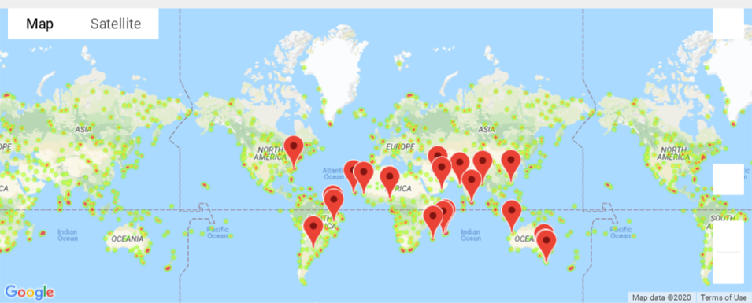

# Python API Homework - What's the Weather Like?

## Background

This project is to visualize the weather of randomly selected 500+ cities across the world of varying distance from the equator.

## Part I - WeatherPy

This project utilizes, the [OpenWeatherMap API](https://openweathermap.org/api) and citipy python library to create a representative model of weather across world cities. 

API calls are used to gather information about current weather around the globe. 
The information goes into some of the relations a cities latitude and longitude has on things like humidity, cloudiness, wind speed, and max temperatures. Series of scatter plots are used to showcase the following relationships:

* Temperature (F) vs. Latitude
* Humidity (%) vs. Latitude
* Cloudiness (%) vs. Latitude
* Wind Speed (mph) vs. Latitude

A linear regression has been run on each relationship, separating them into Northern Hemisphere (greater than or equal to 0 degrees latitude) and Southern Hemisphere (less than 0 degrees latitude):

* Northern Hemisphere - Temperature (F) vs. Latitude
* Southern Hemisphere - Temperature (F) vs. Latitude
* Northern Hemisphere - Humidity (%) vs. Latitude
* Southern Hemisphere - Humidity (%) vs. Latitude
* Northern Hemisphere - Cloudiness (%) vs. Latitude
* Southern Hemisphere - Cloudiness (%) vs. Latitude
* Northern Hemisphere - Wind Speed (mph) vs. Latitude
* Southern Hemisphere - Wind Speed (mph) vs. Latitude

#### For detail report please refer Observations.docx

### Part II - VacationPy 
Using part I analysis to determine great vacation spots. The end result is finding hotels at preffered vacation cities.
Utilized jupyter-gmaps and the Google Places API for this part.
Created a heat map that displays the humidity for every city from the part I.

  
  